# Setup a Static Website Using Nginx

Welcome to your first project. Get ready to launch your very own static website. In this project, you'll be:

- **Building with Nginx:** We'll set up Nginx as your web server, the engine that delivers your website content to the world.
- **Connecting with Route53:** You'll learn how to configure Amazon Route53, the DNS service that directs visitors to your website's location.
- **Securing with Certbot:** We'll implement HTTPS encryption using Certbot, ensuring a safe and secure connection for your website.

By the end of this project, you'll have a fully deployed and secure static website ready to share with the world!

> [!NOTE]
An AWS account is required to carry out this project so ensure you get 1.

## Introduction

Before we begin the project, let's review some of the key concepts and tasks we'll be tackling.

### Nginx

Nginx (pronounced "engine-x") is a high-performance web server and reverse proxy server that is widely used for serving static content, load balancing, and handling reverse proxy tasks. It is known for its speed, stability, and low resource consumption, making it an excellent choice for high-traffic websites. Nginx can also be used as an HTTP cache, an email proxy server, and a load balancer for HTTP, TCP, and UDP traffic. Its flexibility and scalability make it a popular choice among developers and system administrators.

### Route53

Amazon Route 53 is a scalable and highly available Domain Name System (DNS) web service offered by Amazon Web Services (AWS). It is designed to route end-user requests to internet applications by translating human-readable domain names (like www.example.com) into IP addresses that computers use to connect to each other. Route 53 also allows you to:

- **Register Domain Names**: You can purchase and manage domain names directly through Route 53.
- **DNS Routing**: You can configure various routing policies, including simple, weighted, latency-based, failover, and geolocation routing to direct traffic based on different criteria.
- **Health Checks and Monitoring**: Route 53 can monitor the health of your web applications and automatically route traffic to healthy endpoints.
- **Integration with Other AWS Services**: It seamlessly integrates with other AWS services, making it easier to manage your infrastructure and improve application performance and reliability.

Route 53 is designed to provide developers and businesses with an extremely reliable and cost-effective way to route end users to internet applications.

### Certbot

Certbot is an open-source tool for automating the process of obtaining and renewing SSL/TLS certificates from the Let's Encrypt Certificate Authority (CA). These certificates are used to enable HTTPS on websites, which encrypts data transmitted between the server and the client's browser, enhancing security.

#### Key Features of Certbot:

- **Automated Certificate Management**: Certbot can automatically obtain and install certificates on your server.
- **Renewal Automation**: It can automatically renew certificates before they expire, ensuring continuous security.
- **Compatibility**: Certbot supports a wide range of web servers, including Apache and Nginx.
- **Ease of Use**: It simplifies the process of switching from HTTP to HTTPS by handling most of the complex details for you.

#### How Certbot Works:

1. **Install Certbot**: Install Certbot on your server.
2. **Obtain a Certificate**: Use Certbot to request a certificate from Let's Encrypt. Certbot will verify that you control the domain for which you are requesting the certificate.
3. **Install the Certificate**: Certbot can automatically configure your web server to use the new certificate.
4. **Renewal**: Certbot will periodically check for expiring certificates and renew them automatically.

Certbot is widely used because it provides a straightforward and automated way to improve web security with minimal effort.

---

## Project 1

|S/N | Project Tasks                                                                   |
|----|---------------------------------------------------------------------------------|
| 1  |Buy a domain name from a domain Registrar                                        |
| 2  |Spin up an Ubuntu server & assign an elastic IP to it                            |
| 3  |SSH into the server and install Nginx                                            |
| 4  |Download freely HTML website files(too plate) or use your personal code          |
| 5  |Copy the website files to the Nginx website directory                            |
| 6  |Validate the website using the server IP address                                 |
| 7  |In Route53, create an A record and add the Elastic IP                            |
| 8  |Using DNS verify the website setup                                               |
| 9  |Install certbot and Request For an SSL/TLS Certificate                           |
| 10 |Validate the website SSL using the OpenSSL utility                               |

## Key Concepts Covered

- AWS (EC2 and Route 53)
- EC2
- Linux(Ubuntu)
- Nginx
- DNS
- SSL (certbot)
- OpenSSL command

## Checklist

- [x] Task 1: Buy a domain name from a domain Registrar.
- [x] Task 2: Spin up a Ubuntu server & assign an elastic IP to it.
- [x] Task 3: SSH into the server and install Nginx.
- [x] Task 4: Find freely available HTML website files.
- [x] Task 5: Download and unzip the website files to the Nginx website directory.
- [x] Task 6: Validate the website using the server IP address.
- [x] Task 7: In Route53, create an A record and add the Elastic IP.
- [x] Task 8: Using DNS verify the website setup.
- [x] Task 9: Install certbot and Request For an SSL/TLS Certificate.
- [x] Task 10: Validate the website SSL using the OpenSSL utility.

## Documentation

### Create An Ubuntu Server

- Locate and click on **EC2** within the AWS management console.

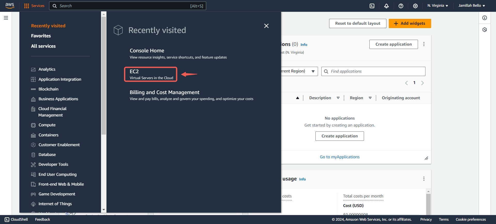

- Click on **Launch Instance**

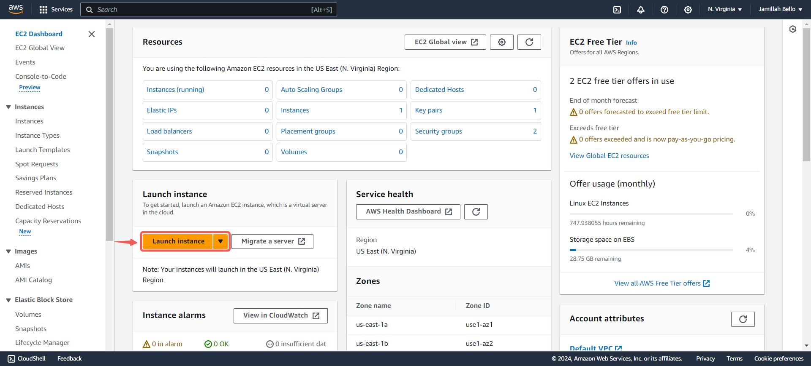

- **Name** your instance and select the **Ubuntu** AMI.

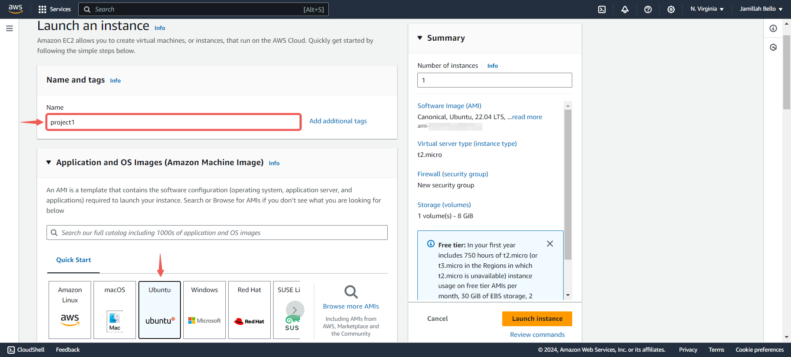

- Click the **Create new key pair** button to generate a key pair for secure connection to your instance.

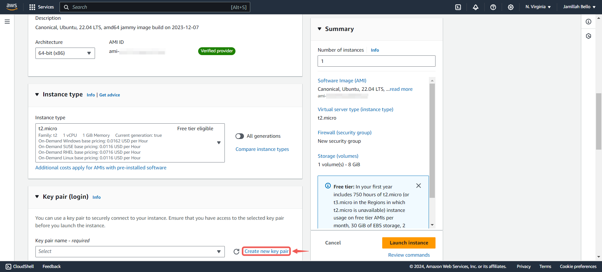

- Enter a **Key pair name** and click on **Create key pair**.


- Enable **SSH**, **HTTP**, and **HTTPS** access, then proceed to click **Launch instance**.


> [!NOTE]
For security reasons, it's recommended to restrict SSH access to your IP address only. However, for the purpose of this documentation, access has been granted from anywhere.

- Click on **View all instances**.


- Click on the **created instance**.


- Click on the **Connect** button.

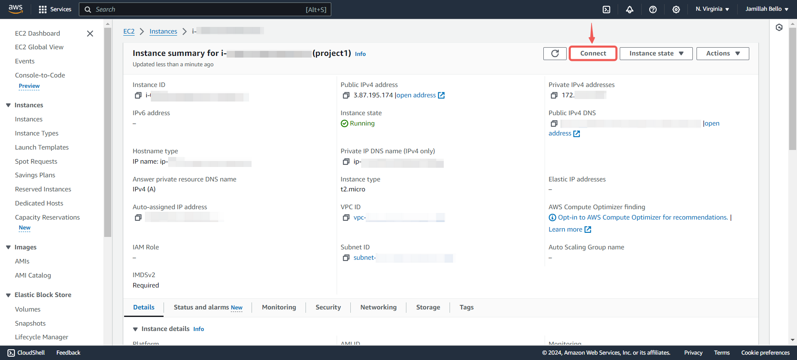

- Copy the command provided under **`SSH client`**.


- Open a terminal in the directory where your **`.pem`** file was downloaded, paste the command and press Enter.


---

**How to open a terminal in your downloads folder on windows:**

- Navigate to your downloads folder (or the folder where you saved your .pem file), right-click, and choose **Open in terminal**.

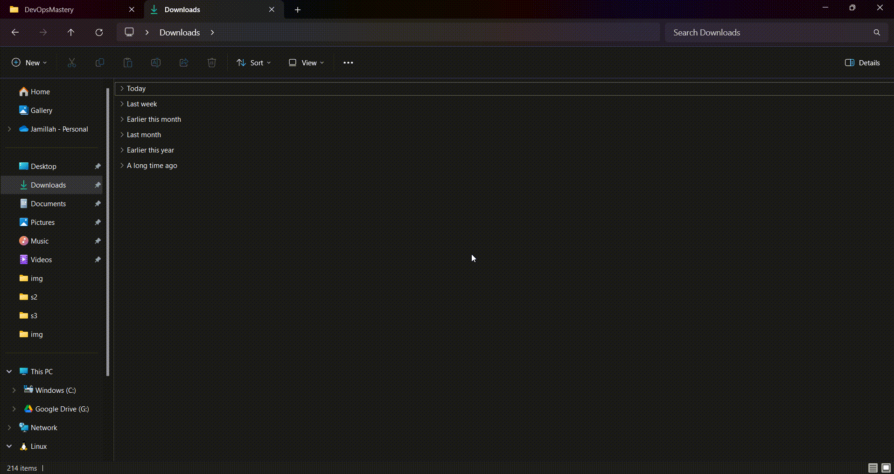

**How to open the Terminal in a specific folder where your EC2 instance key pair (.pem file) was downloaded on a Mac:**

1. **Using Finder:**
   - Open **Finder** and navigate to the folder where your `.pem` file is located (usually the Downloads folder).
   - Right-click (or Control-click) on the folder.
   - Select **Services** from the context menu, then choose **New Terminal at Folder**. (If you don’t see this option, you might need to enable it in **System Preferences** under **Keyboard** > **Shortcuts** > **Services**.)

2. **Using Terminal with Drag and Drop:**
   - Open **Terminal** from Spotlight or Finder.
   - In Finder, navigate to the folder where your `.pem` file is located.
   - Drag the folder (or the `.pem` file) into the open Terminal window. This will automatically populate the Terminal with the path to that folder.
   - If you dragged the folder, you can type `cd ` (with a space) before dropping it to change into that directory. For example: `cd /Users/yourusername/Downloads/` (after dragging, it will show the complete path).

3. **Using the `cd` Command:**
   - Open **Terminal**.
   - Use the `cd` command to navigate to the folder where your `.pem` file is located. For example, if your key pair is in the Downloads folder, type:

    ```
     cd ~/Downloads
    ```

   - Press `Enter` to execute the command.

After following any of these methods, your Terminal will be opened in the directory where your `.pem` file is located, and you can use it to execute commands related to your EC2 instance.

---

### Create And Assign an Elastic IP

- Return to your AWS console and click on the **menu icon** to open the dashboard menu.

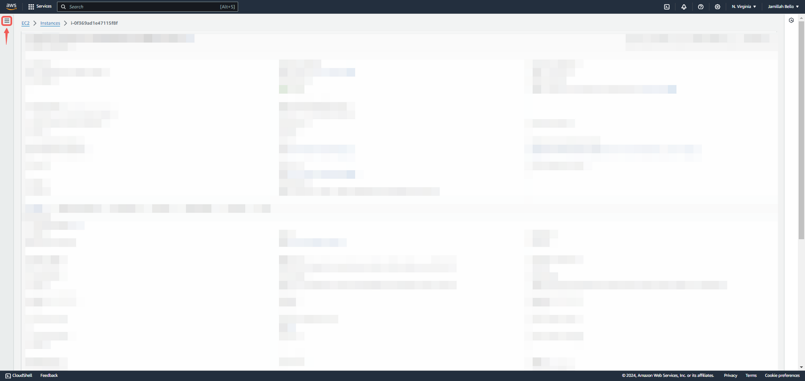

- Select **Elastic IPs** under **Network & Security**.


- Click on the **Allocate Elastic IP address** button.

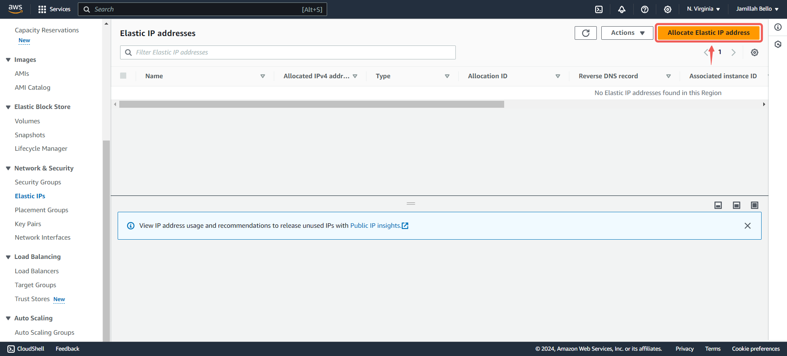

- Keep the settings unchanged and proceed to click **Allocate**.


- **Associate this Elastic IP address** with your running instance.

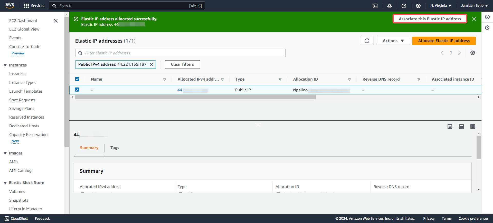

- Select the instance you wish to associate with the elastic IP address, then click on **Associate**.

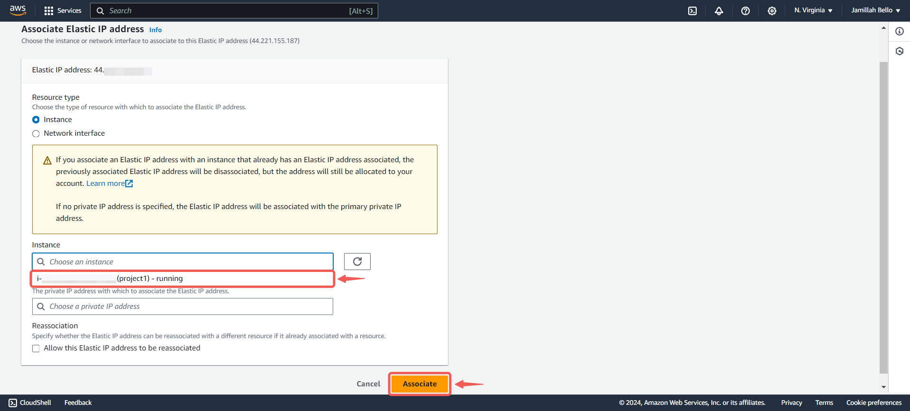

> [!NOTE]
The IP address for your instance has been updated to the elastic IP associated with it. Therefore, you will need to SSH into your instance again. Return to the connection page of your instance and copy the new command.

- Paste the **command** into your terminal and then press Enter. When prompted, type **"yes"** and press Enter to connect.

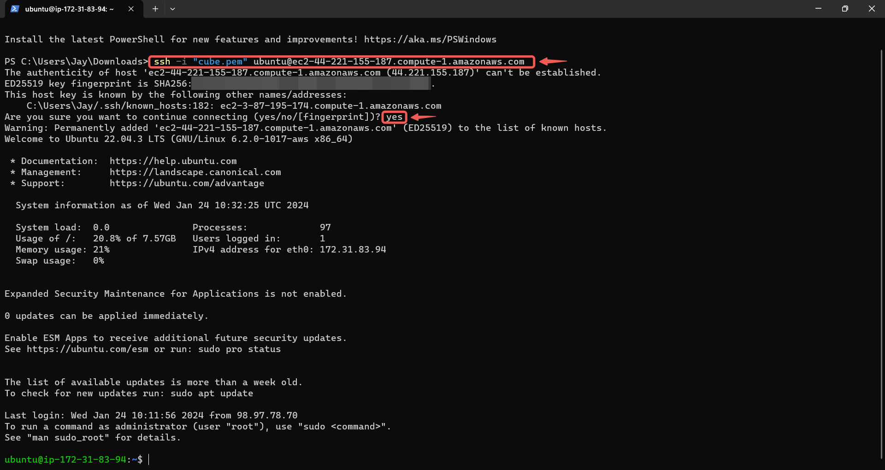

---

### Install Nginx and Setup Your Website

- Execute the following commands.

`sudo apt update`

`sudo apt upgrade`

`sudo apt install nginx`

- Start your Nginx server by running the **`sudo systemctl start nginx`** command, enable it to start on boot by executing **`sudo systemctl enable nginx`**, and then confirm if it's running with the **`sudo systemctl status nginx`** command.


- Go back to your EC2 dashboard and copy your **Public IPv4 address**.

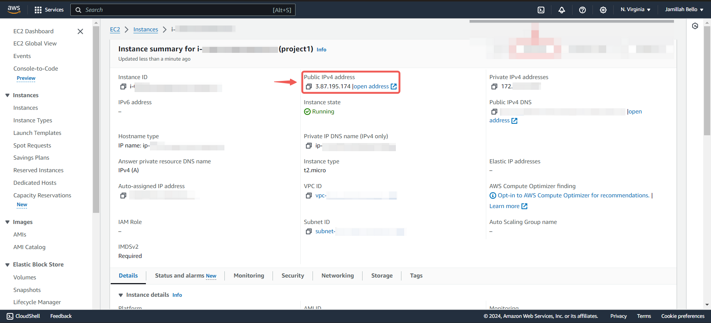

- Visit your instances **Public IPv4 address** in a web browser to view the default Nginx startup page.

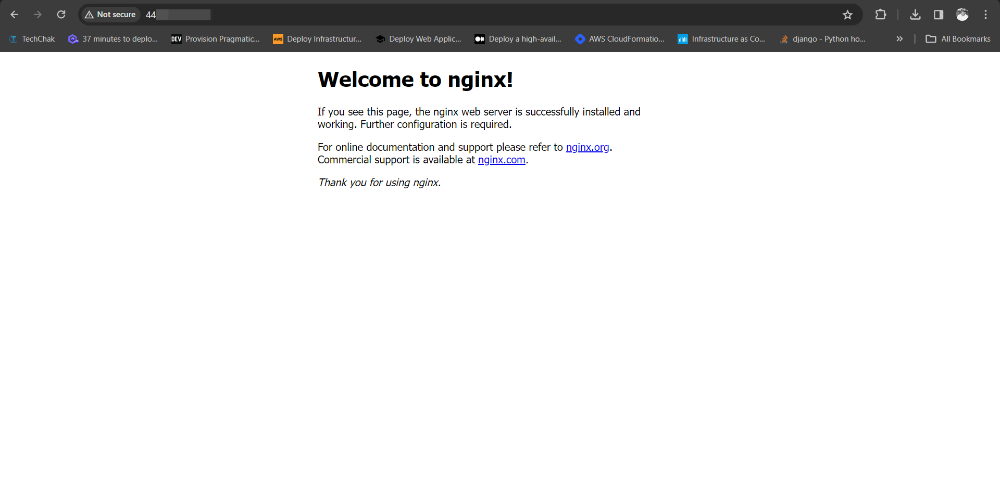

- Download your website template from your preferred website by navigating to the website, locating the template you want, and obtaining the download URL for the website.


---

**How to obtain the website template URL from tooplate.com:**

- Visit [**Tooplate**](https://www.tooplate.com/) and select the website template you prefer.


- Scroll down to the download section, right-click to open the menu, and select **Inspect** from the options.

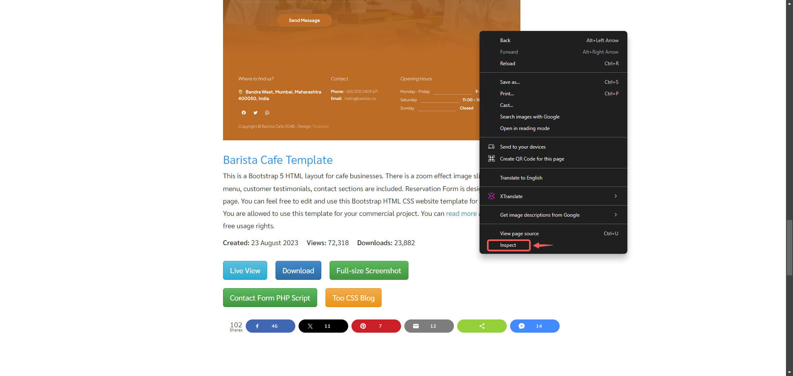

- Select the **Network** tab.

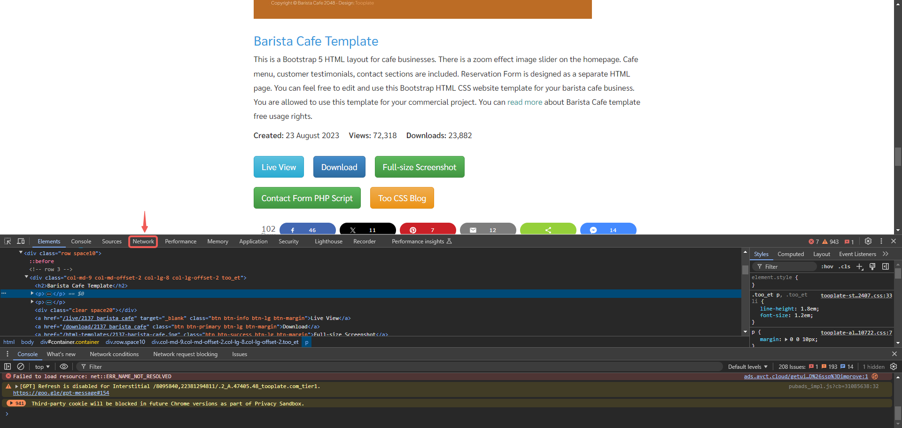

- Click the **Download** button.

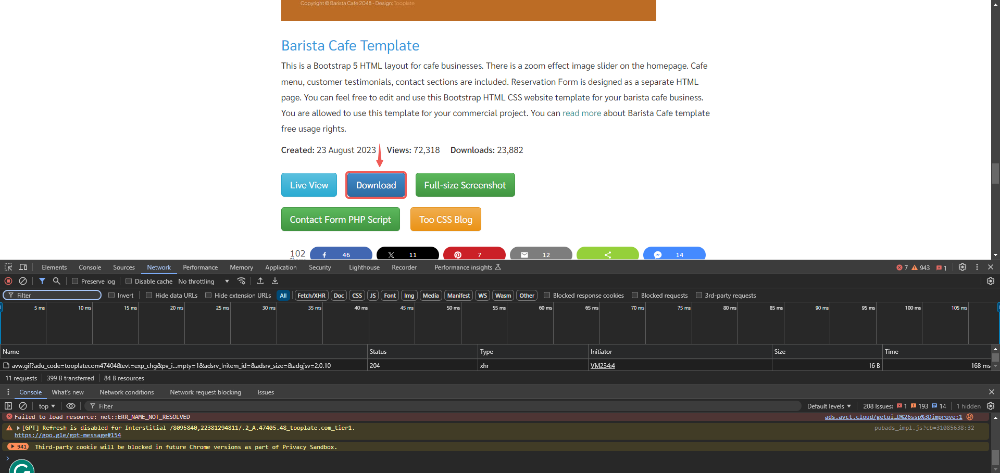

- You’ll see the **website zip folder** appear. Hover your mouse or trackpad pointer over it and right-click again.

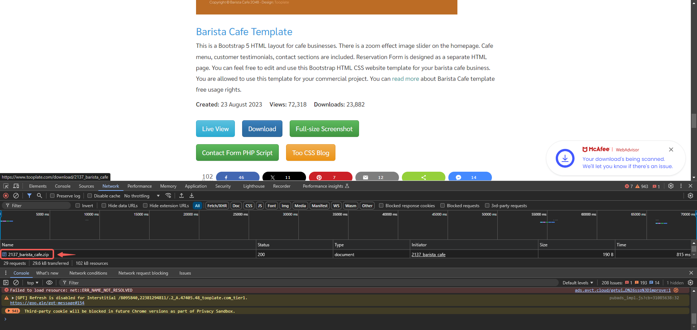

> [!NOTE]
Make sure you right-click on the zip folder, the one that says **.zip**. If it doesn't appear after clicking download, try clicking the download button again until it shows up, as shown in the picture.

- Hover your mouse cursor over **Copy①** and then click on **Copy URL②** from the list that appears on the right.

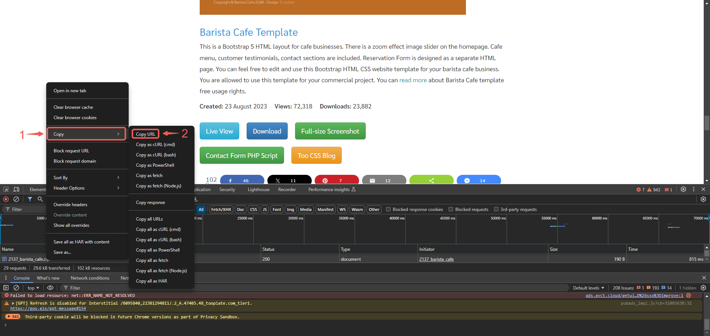

- Paste the URL into a notebook to use alongside the **`curl`** command when downloading the website content to your machine.

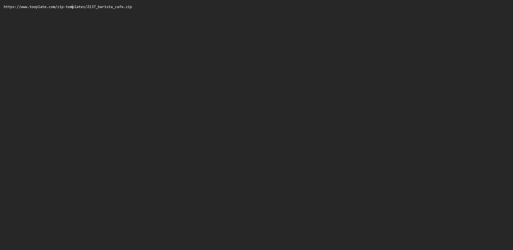

---

- Run this command **`sudo curl -o /var/www/html/2137_barista_cafe.zip https://www.tooplate.com/zip-templates/2137_barista_cafe.zip`** to download the websites file to your html directory.

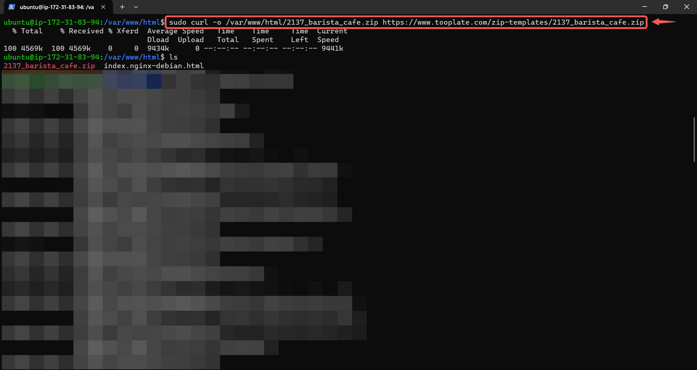

> [!NOTE]
The **`curl`** command is a utility for making HTTP requests via the command line. Here, it's utilized to retrieve a file from a specified URL.
The **`-o`** flag designates the output file or destination. In this instance, it signifies that the downloaded file, named **"2137_barista_cafe.zip"**, should be stored in the **"/var/www/html/"** directory.
The URL **`https://www.tooplate.com/zip-templates/2137_barista_cafe.zip`** is the source for downloading the file. Make sure to replace it with the URL of your own website template. Curl will retrieve the content located at this URL.

- To install the unzip tool, run the following command: **`sudo apt install unzip`**.

- Navigate to the web server directory by running the following command: **`cd /var/www/html`**.


- Unzip the contents of your website by running **`sudo unzip <website template name>`**.

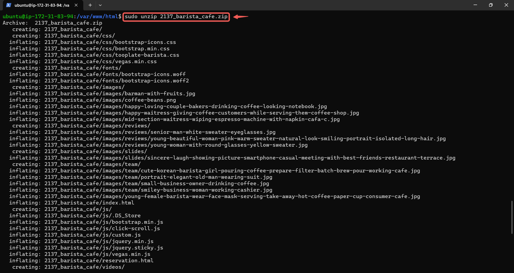

> [!NOTE]
Replace **`<website template name>`** with the actual name of your website zip file. For example, mine is **2137_barista_cafe.zip** so i ran **`sudo unzip 2137_barista_cafe.zip`**.

- Update your nginx configuration by running the command **`sudo nano /etc/nginx/sites-available/default`**. Then, edit the **`root`** directive within your server block to point to the directory where your downloaded website content is stored.


- Restart Nginx to apply the changes by running: **`sudo systemctl restart nginx`**.

- Open a web browser and go to your **Public IPv4 address/Elastic IP address** to confirm that your website is working as expected.


---

### Create An A Record

To make your website accessible via your domain name rather than the IP address, you'll need to set up a DNS record. I did this by buying my domain from Namecheap and then moving hosting to AWS Route 53, where I set up an A record.

> [!NOTE]
Your domain registrar's interface might look different, but they all follow a similar basic layout.

- On the website click on **Domain List**.

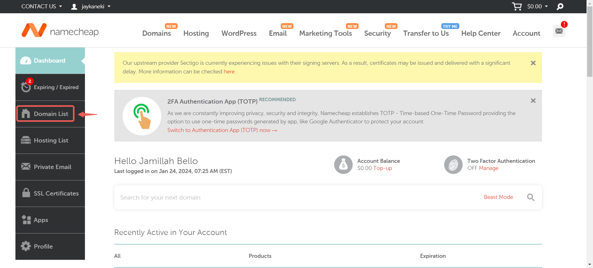

- Click on the **Manage** button.

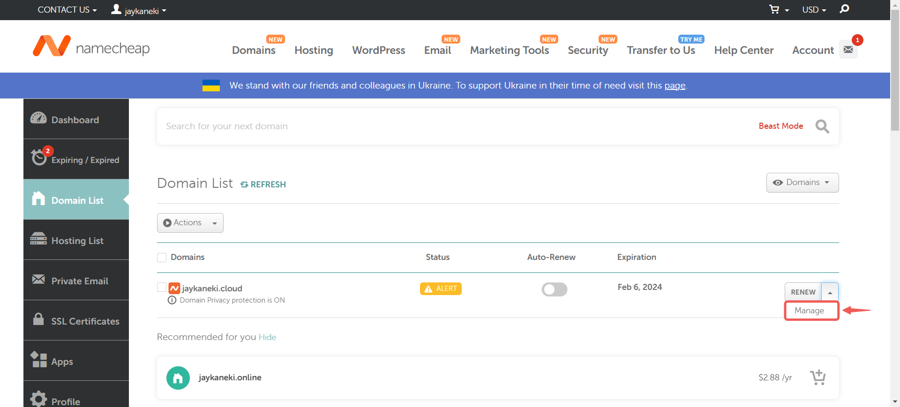

- Go back to your AWS console, search for **Route 53①**, and then choose **Route 53②** from the list of services shown.

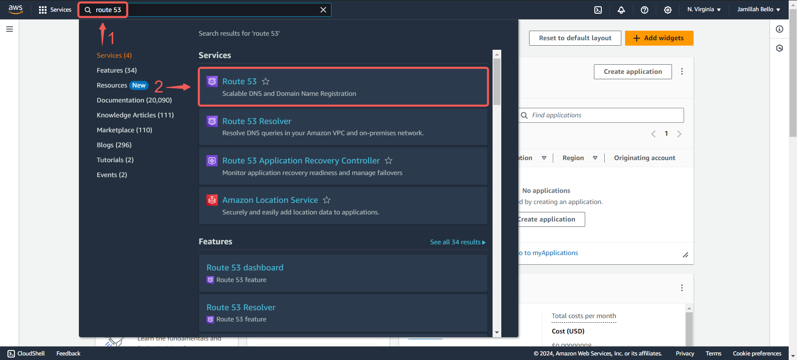

- Click on **Get started**.


- Select **Create hosted zones①** and click on **Get started②**.

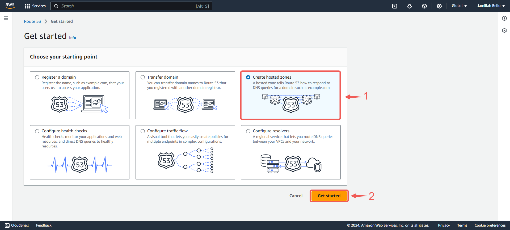

- Enter your **Domain name①**, choose **Public hosted zone②** and then click on **Create hosted zone③**.

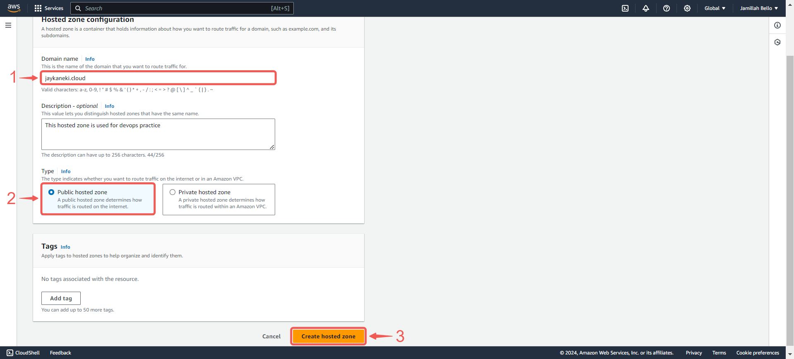

- Select the **created hosted zone①** and copy the assigned **Values②**.


- Go back to your domain registrar and select **Custom DNS** within the **NAMESERVERS** section.

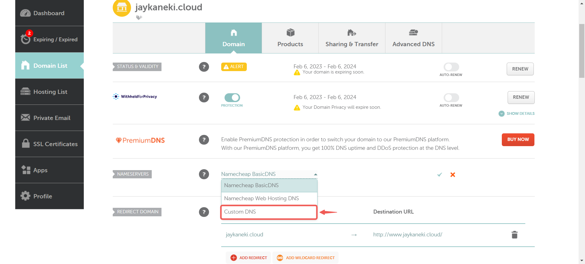

- Paste the values you copied from Route 53 into the appropriate fields, then click the **checkmark symbol** to save the changes.


- Head back to your AWS console and click on **Create record**.

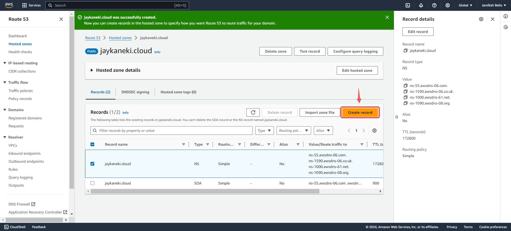

- Paste your Elastic IP address and then click on **Create records**.

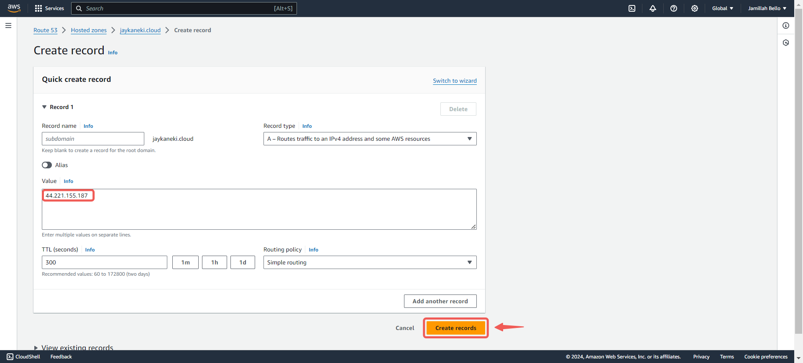

- Your A record has been successfully created.


- Click on **create record** again, to create the record for your sub domain.

- Input the Record name(**www➀**), paste your **IP address➁**, and then click on **Create records➂**.

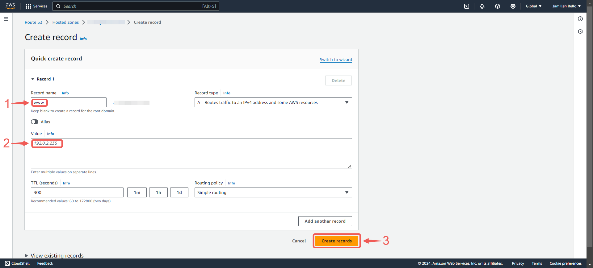

> [!NOTE]
Make sure to create DNS records for both your root domain and subdomain. This involves setting up an A record for the root domain (e.g., **`example.com`**) and another A record for the subdomain (e.g., **`www.example.com`**). These records will direct traffic to your server's IP address, ensuring that both your main site and any subdomains are accessible.

- Open your terminal and run **`sudo nano /etc/nginx/sites-available/default`** to edit your settings. Enter your domain and subdomain names, then save the changes.


- Restart your nginx server by running the **`sudo systemctl restart nginx`** command.

- Go to your domain name in a web browser to verify that your website is accessible.

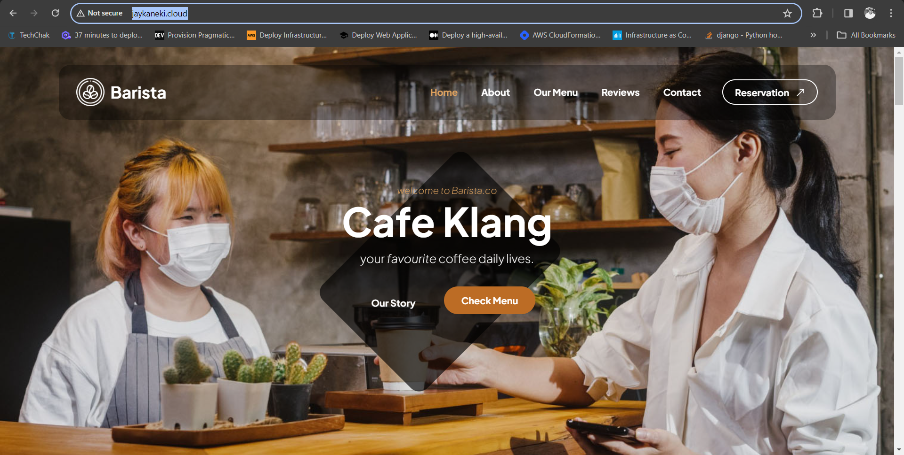

> [!NOTE]
You may notice the sign that says **Not secure**. Next, you'll use certbot to obtain the SSL certificate necessary to enable HTTPS on your site.

---

### Install certbot and Request For an SSL/TLS Certificate

- Install certbot by executing the following commands:
**`sudo apt update`**
**`sudo apt install certbot python3-certbot-nginx`**

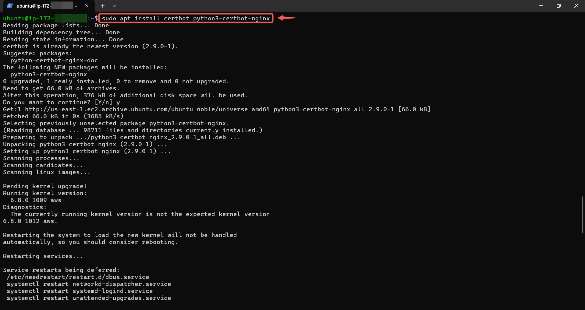

- Execute the **`sudo certbot --nginx`** command to request your certificate. Follow the instructions provided by certbot and select the domain name for which you would like to activate HTTPS.

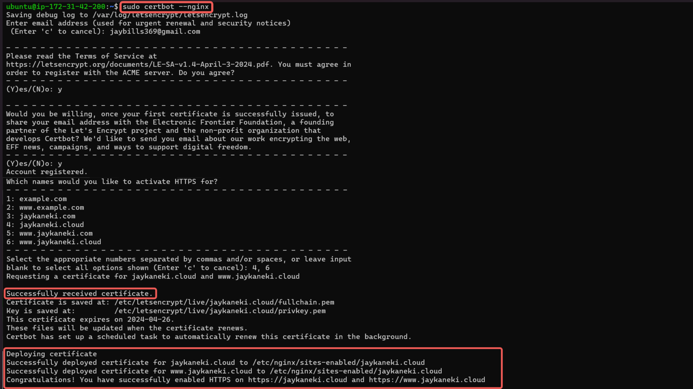

- Verify the website's SSL using the OpenSSL utility with the command: **`openssl s_client -connect jaykaneki.cloud:443`**

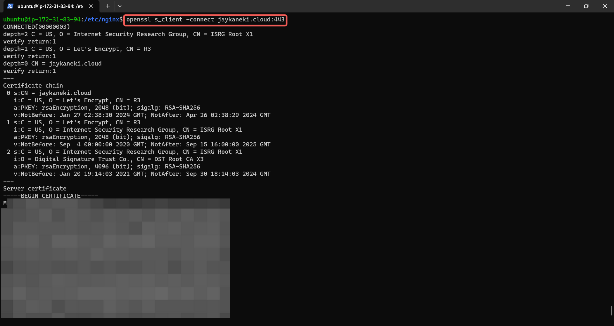

- Visit **`https://<domain name>`** to view your website.


---
---

#### The End Of Project 1
